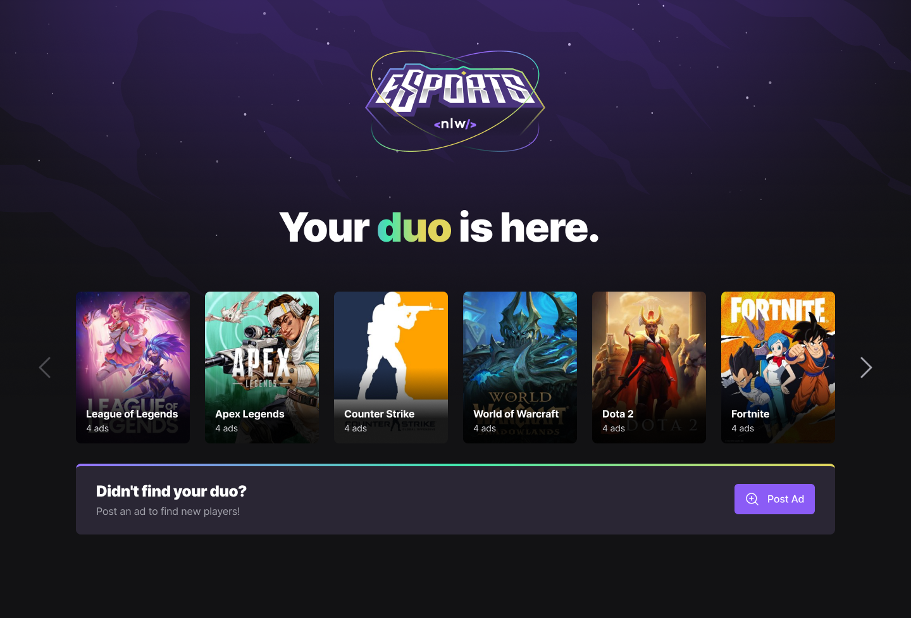

<h1 align="center">
    
</h1>

<h4 align="center"> 
  🚀 Application developed during the 8th NLW by Rocketseat 🚀
</h4>

  	
  
	
  
  
  
  
  

---

<h1 align="center">
    
</h1>

&nbsp;

## 🔎 Overview

During the event **NLW eSports** we have developed a _web_ and _mobile_ platform where Gamers can find partners for the most popular games being displayed on Twitch. This project is part of the Ignite Trail and we learned about React with TypeScript and React Native with Expo.

The web application allows us to create ads and find game partners (or duos). In the mobile application, we can access those ads to view the informations about each player and copy their Discord username to clipboard, so we can add them to our friends list.

This project was developed during the event **#NLWtogether** hosted by [Rocketseat](https://www.rocketseat.com.br) with the help of the instructors [Diego Fernandes](https://github.com/diego3g) and [Rodrigo Gonçalves](https://github.com/rodrigorgtic).

| 🪧 Vitrine.Dev   |     |
| --------------- | --- |
| ✨ Nome         | **NLW eSports** - Rocketseat |
| 🏷️ Tecnologias  | React, React Native, TypeScript, Tailwind, Prisma, Radix-UI, Vite, Expo, Axios |
| 🚀 URL          | Not yet available |
| 🔥 Design       | [**Figma**](https://www.figma.com/community/file/1150897317533332617) |

## ✏️ Features
- [X] Back-end (server) and front-end (web) connection to show the games
- [X] Ad creation connection with API (backend)
- [X] List of games with ad count
- [X] New ad creation interface
  - [X] Leave the "when do you usually play?" part functional
  - [X] Customize the checkbox
  - [X] Register the ad in the API
- [X] Search discord by ad ID
- [X] List of ads by game
- [X] Creation of a new advertisement

## :rocket: Technologies

This project was developed with the following technologies:

- [Node.js](https://nodejs.org/en/) 
- [React](https://reactjs.org)
- [React Native](https://facebook.github.io/react-native/)
- [Expo](https://expo.io/)
- [TypeScript](https://www.typescriptlang.org/)
- [Vite](https://vitejs.dev/)
- [TailwindCSS](https://tailwindcss.com/)
- [Phosphor Icons](https://phosphoricons.com/)

## 🩹 Improvements needed

The project was totally developed according to the instructions given, no aditionals. In the future, it would be interesting to add the following implementations:

- [ ] Web responsivity;
- [ ] Carousel for scrolling through games, in case we have more games in the database (lib suggested: [Keen Slider](https://keen-slider.io/));
- [X]  Replacing standard `select` element with [Radix-UI Select](https://www.radix-ui.com/docs/primitives/components/select);
- [ ] Form validation with [React Hook Form](https://react-hook-form.com/);
- [ ] Discord authentication, automatically filling the form field for Discord username.

---

## :memo: License

This project is under the MIT license. See the [LICENSE](LICENSE) for details.